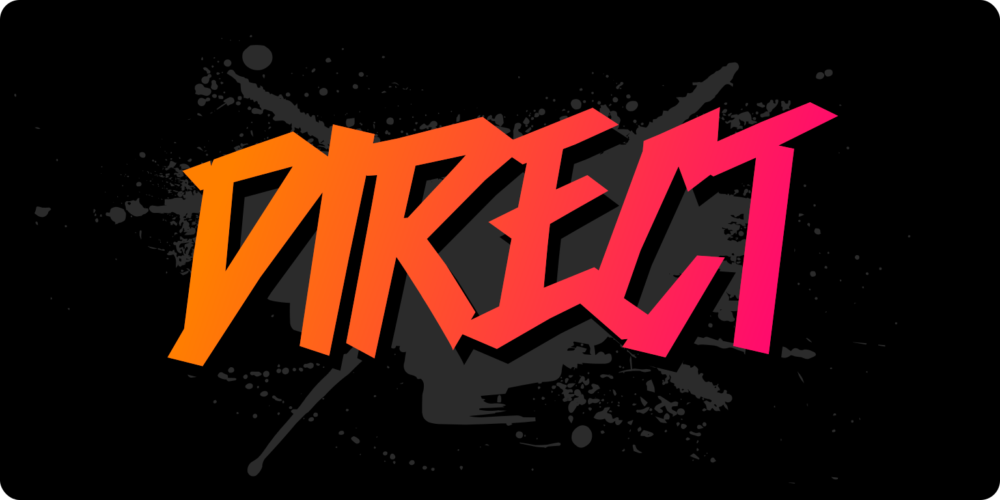

# Direct

Direct is a combination website builder & blog engine that makes cinematic web experiences. You can think of Direct as a mix between WordPress, Instagram, Canva, WebFlow, and PowerPoint.

Today's blog engines focus on long-form text articles, and do a reasonably good job at this. However, most people want to consume terse, impactful content, such as what you would find on most social media sites. Direct is designed to make creating and posting this type of content as easy as possible, and without handing over to some third party platform.

Direct is scene-based. Each page you post is constructed from one or more scenes which consume the whole screen, which your viewer can swipe though vertically, similar to the TikTok video feed experience. Direct has 3 different kinds of scenes:

- *Canvas scenes* – Arrange custom background images and overlay titles, descriptions, call-to-action buttons ontop of them.

- *Gallery scenes* – Arrange one or more images or videos in a horizontally swipable gallery, similar to how Instagram posts.

- *Prose scenes* – Write out your thoughts in an editor with some basic formatting (headings, paragraphs, bold, links, etc)

Direct also runs entirely on your device. There's no need for any server at all (unless you want to publish somewhere). In fact, if you clone this repository and build, you can simply drag the `/build/index.html` file directly into a browser, and the web version of the app will operate with full fidelity. All of the data is stored locally in IndexedDB and localStorage, and you can export a .zip file containing your website.

## Current State: Alpha

Direct is current in an alpha state. It's being used to build the website at [https://www.directblog.org](https://www.directblog.org). If you want to try the web version, it is available at [https://app.directblog.org](https://app.directblog.org). For the optimal experience on macOS, there is a desktop macOS app. This app is built using [Tauri](https://tauri.app/) rather than Electron, so the memory footprint is minimal.
